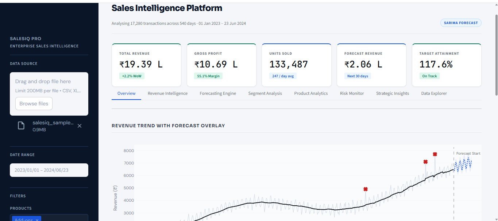
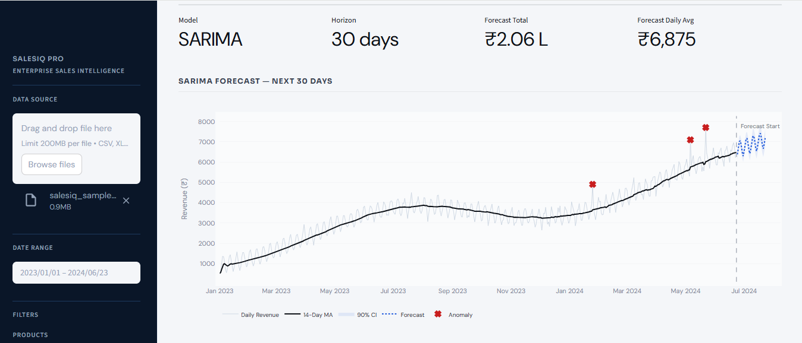
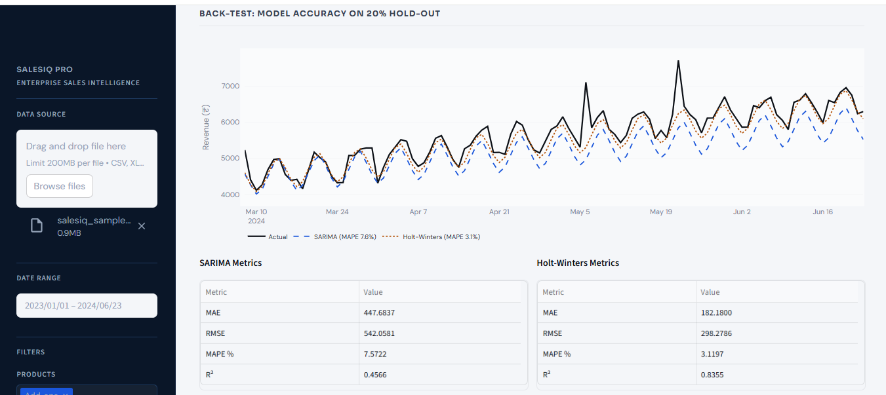
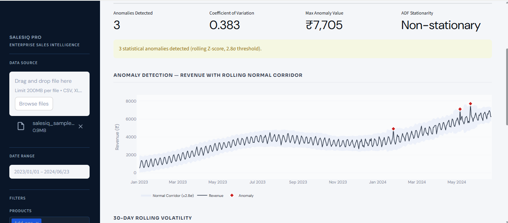
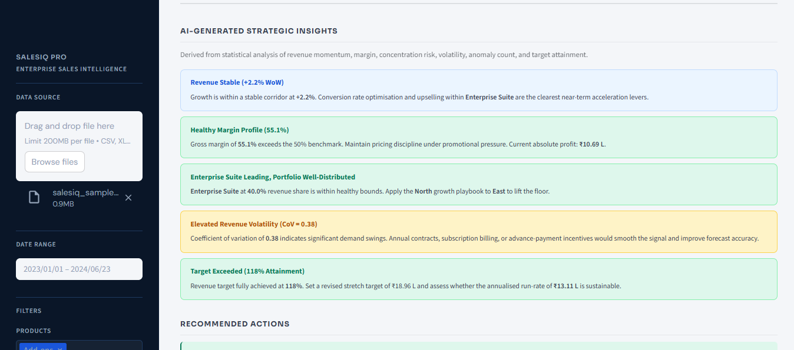

# 📈 Advanced Sales Forecasting with Time Series Analysis

<p align="center">
  
</p>

<p align="center">
  
  
  
  
  
</p>

<p align="center">
  <b>Advanced Sales Forecasting with Time Series Analysis</b>
</p>

<p align="center">
  A business intelligence and forecasting platform that leverages time series analysis techniques to predict future sales trends, identify anomalies, assess risks, and support data-driven business decisions.
</p>

---

## 🎯 Project Objective

This project focuses on analyzing historical sales data and generating accurate forecasts using advanced time series forecasting models. The platform combines forecasting, risk monitoring, statistical analysis, and interactive visualizations into a single dashboard to help businesses make informed decisions.

---

## 🌟 Key Highlights

✅ Interactive Sales Analytics Dashboard

✅ Time Series Forecasting using SARIMA

✅ Holt-Winters Triple Exponential Smoothing

✅ Ensemble Forecasting Approach

✅ Monte Carlo Revenue Simulation

✅ Z-Score Based Anomaly Detection

✅ Strategic Business Insights

✅ Interactive Plotly Visualizations

---

## 📸 Dashboard Preview

### 📊 Overview Dashboard


### 🔮 Forecast Model Comparison


### 📈 Forecast Scenario Analysis


### ⚠️ Risk Monitor


### 🎯 Strategic Insights


---

## 🚀 Features

### 📈 Revenue Intelligence
- Revenue trend analysis
- Forecast overlay visualization
- Time-series decomposition
- Revenue growth monitoring
- Seasonal pattern identification

### 🔮 Forecasting Engine
- SARIMA Forecasting
- Holt-Winters Forecasting
- Ensemble Forecasting
- Forecast confidence intervals
- Forecast model comparison
- Accuracy metrics evaluation

### 📊 Sales Analytics
- Product-wise performance analysis
- Region-wise revenue analysis
- Channel-wise sales insights
- Revenue distribution heatmaps

### ⚠️ Risk Monitoring
- Anomaly detection using Z-Scores
- Revenue volatility tracking
- Correlation analysis
- Business risk assessment

### 🎯 Strategic Insights
- Automated recommendations
- Growth opportunity identification
- Profitability analysis
- Target attainment monitoring

---

## 🛠️ Tech Stack

| Category | Technologies |
|-----------|-------------|
| Programming Language | Python |
| Dashboard Development | Streamlit |
| Data Analysis | Pandas, NumPy |
| Data Visualization | Plotly |
| Statistical Analysis | SciPy |
| Forecasting Models | Statsmodels |
| File Processing | OpenPyXL |

---

## 📊 Forecasting Techniques Implemented

### Time Series Models
- SARIMA (Seasonal AutoRegressive Integrated Moving Average)
- Holt-Winters Triple Exponential Smoothing
- Ensemble Forecasting

### Statistical Methods
- Augmented Dickey-Fuller (ADF) Test
- Seasonal Decomposition
- Correlation Analysis
- Revenue Volatility Analysis

### Risk Analysis
- Z-Score Based Anomaly Detection
- Confidence Interval Forecasting
- Monte Carlo Revenue Simulation

---

## 📂 Project Structure

```bash
Advanced-Sales-Forecasting/
│
├── screenshots/
│   ├── overview-dashboard.png
│   ├── forecast-model-comparison.png
│   ├── forecast-scenario-analysis.png
│   ├── risk-monitor.png
│   └── strategic-insights.png
│
├── app.py
├── requirements.txt
├── README.md
└── sample_data.csv
```

---

## ⚙️ Installation

### Clone Repository

```bash
git clone https://github.com/vaishu-chavan-26/Advanced-Sales-Forecasting.git
```

### Navigate to Project Directory

```bash
cd Advanced-Sales-Forecasting
```

### Install Dependencies

```bash
pip install -r requirements.txt
```

### Run Application

```bash
streamlit run app.py
```

---

## 📁 Dataset Requirements

The application accepts CSV or Excel files containing:

| Column | Description |
|----------|------------|
| date | Transaction Date |
| product | Product Name |
| region | Sales Region |
| channel | Sales Channel |
| revenue | Revenue Generated |
| units | Units Sold |
| cost | Product Cost |
| profit | Profit (Optional) |

If the profit column is not available, it is automatically calculated.

---

## 🎯 Business Value

- Improve sales forecasting accuracy
- Detect unusual sales patterns
- Identify high-performing products and regions
- Reduce forecasting uncertainty
- Support strategic business decisions
- Monitor business risks proactively

---

## 🔮 Future Enhancements

- Machine Learning Forecast Models
- XGBoost & Prophet Forecasting
- Real-Time Database Integration
- Automated PDF Report Generation
- Cloud Deployment
- User Authentication
- AI-Powered Business Recommendations

---

## 👩‍💻 Author

### Vaishnavi Chavan

B.E. Computer Science Engineering (AI & ML)

GitHub: https://github.com/vaishu-chavan-26

---

## ⭐ Support

If you found this project useful, consider giving it a ⭐ on GitHub.

---

## 📜 License

This project is developed for educational, learning, and portfolio purposes.
